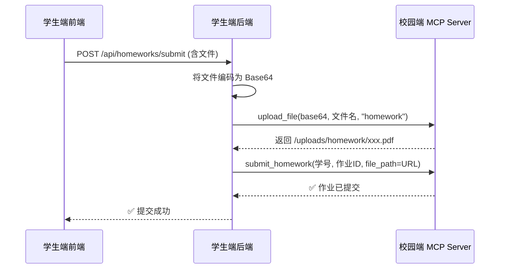
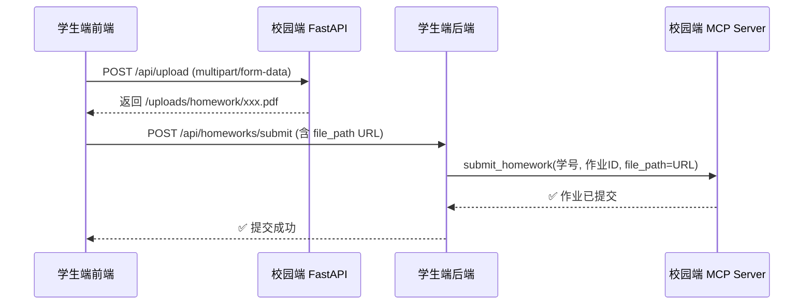

# 🎒 学生端项目开发文档

> 学生端是一个**独立的项目**，有自己的前端、后端、本地数据库。
> 通过与校园端 MCP 对接完成校园事务，同时拥有学生自己的本地功能。

---

## 🏗️ 技术栈

| 层级 | 技术选型 | 说明 |
|:----|:---------|:-----|
| 🖥️ 前端 | **React 18 + Vite** | 现代化前端框架 |
| 🎨 UI | **TailwindCSS + 组件库** | 建议 Semi Design / Antd Mobile |
| 🌐 前端路由 | **React Router v6** | 页面路由 |
| 📡 请求 | **fetch / axios** | HTTP 请求 |
| 🤖 LLM | **DeepSeek V4 Flash** | 学生端 Agent（可选） |
| 🐍 后端 | **FastAPI (Python 3.11+)** | 学生端自有的后端服务 |
| 🗄️ 本地数据库 | **SQLite** | 本地数据存储 |
| 🔗 MCP 对接 | **MCP Python SDK** | 连接校园端 MCP Server |
| 🔐 鉴权 | **JWT** | 校园端登录 token |

---

## 📱 前端页面清单

### 1. 登录 / 注册

| 页面 | 功能 | 数据来源 |
|:----|:-----|:--------|
| **登录页** | 输入学号/手机号 + 密码 → 登录 | 校园 MCP: `student_login` |
| **注册页** | 手机号 + 密码 + 姓名 → 选班级 → 注册 | 校园 MCP: `get_class_list` → `student_register` |
| 注册成功后 | 显示学号（系统生成）提示保存 | 校园 MCP 返回 |

### 2. 首页 / 仪表盘

| 功能 | 说明 | 数据来源 |
|:----|:-----|:--------|
| 个人信息卡片 | 姓名、学号、班级、头像 | 校园 MCP: `get_student_info` |
| 今日课表 | 今天的课程时间线 | 校园 MCP: `get_schedule` |
| 待办作业 | 待交作业数量提醒 | 校园 MCP: `get_pending_homeworks` |
| 出勤概览 | 本月出勤率 | 校园 MCP: `get_checkin_stats` |
| 快捷操作 | 签到、交作业、请假入口 | 本地跳转 |

### 3. 课表

| 功能 | 说明 | 数据来源 |
|:----|:-----|:--------|
| 周课表视图 | 周一到周日课程展示 | 校园 MCP: `get_schedule` + `get_courses` |
| 课程卡片 | 课程名、时间、地点、教师 | 校园 MCP |
| 切换周次 | 查看不同周课表 | 本地计算 |

### 4. 签到

| 功能 | 说明 | 数据来源 |
|:----|:-----|:--------|
| 签到页 | 输入6位签到码 → 签到 | 校园 MCP: `do_checkin` |
| 签到记录 | 按日期展示签到历史 | 校园 MCP: `get_checkin_records` |
| 出勤统计 | 饼图/柱状图展示 | 校园 MCP: `get_checkin_stats` |

### 5. 作业

| 功能 | 说明 | 数据来源 |
|:----|:-----|:--------|
| 作业列表 | Tab 切换：待交 / 已交 / 全部 | 校园 MCP: `get_all_homeworks` |
| 作业详情 | 标题、描述、截止时间、提交入口 | 校园 MCP: `get_homework_detail` |
| 提交作业 | 输入文字内容 + **支持上传文件附件（图片/PDF/文档）** | 校园 MCP: `upload_file` → `submit_homework` |
| 成绩列表 | 已批改作业的分数和评语 | 校园 MCP: `get_homework_grades` |

### 6. 请假

| 功能 | 说明 | 数据来源 |
|:----|:-----|:--------|
| 请假页 | 选择课程 + 填写原因 → 提交 | 校园 MCP: `apply_leave` |
| 请假记录 | 我的请假历史 | 本地数据库 |

### 7. 通知 & 公告

| 功能 | 说明 | 数据来源 |
|:----|:-----|:--------|
| 通知列表 | 个人通知（签到提醒/成绩通知等） | 校园 MCP: `get_notifications` |
| 班级公告 | 教师发布的班级/全校公告 | 校园 MCP: `get_announcements` |

### 8. 个人中心

| 功能 | 说明 | 数据来源 |
|:----|:-----|:--------|
| 个人信息 | 姓名、学号、班级、手机号 | 校园 MCP: `get_student_info` |
| 设置 | 修改密码、退出登录 | 本地 |
| 我的操作记录 | 本地记录的操作历史 | **本地数据库** |

---

## 🗄️ 学生端本地数据库（SQLite）

学生端使用自己的 SQLite 数据库存储本地数据，与校园端数据库独立。

### 表结构

```sql
-- 操作记录表（记录学生在学生端的所有操作）
CREATE TABLE operation_logs (
    id          INTEGER PRIMARY KEY AUTOINCREMENT,
    action_type TEXT    NOT NULL,  -- checkin / homework_submit / leave / login / ...
    content     TEXT    NOT NULL,  -- 操作内容描述
    result      TEXT,              -- 操作结果（成功/失败/详情）
    created_at  DATETIME DEFAULT CURRENT_TIMESTAMP
);

-- 本地课表缓存（减少MCP调用）
CREATE TABLE schedule_cache (
    course_id    INTEGER PRIMARY KEY,
    name         TEXT NOT NULL,
    teacher      TEXT,
    location     TEXT,
    day_of_week  INTEGER,
    start_time   TEXT,
    end_time     TEXT,
    cached_at    DATETIME DEFAULT CURRENT_TIMESTAMP
);

-- 通知已读状态
CREATE TABLE notification_reads (
    notification_id INTEGER PRIMARY KEY,
    read_at         DATETIME DEFAULT CURRENT_TIMESTAMP
);

-- 本地便签/备忘（学生自己记的）
CREATE TABLE memos (
    id          INTEGER PRIMARY KEY AUTOINCREMENT,
    title       TEXT,
    content     TEXT,
    is_important BOOLEAN DEFAULT 0,
    created_at  DATETIME DEFAULT CURRENT_TIMESTAMP,
    updated_at  DATETIME DEFAULT CURRENT_TIMESTAMP
);

-- 收藏课程
CREATE TABLE favorite_courses (
    course_id   INTEGER PRIMARY KEY,
    added_at    DATETIME DEFAULT CURRENT_TIMESTAMP
);

-- 校园通知本地记录（轮询缓存）
CREATE TABLE notification_history (
    id              INTEGER PRIMARY KEY AUTOINCREMENT,
    campus_notif_id INTEGER,          -- 校园端通知ID
    title           TEXT,
    content         TEXT,
    notif_type      TEXT,             -- grade_notice / leave_result / checkin_reminder / announcement
    is_read         BOOLEAN DEFAULT 0,
    received_at     DATETIME DEFAULT CURRENT_TIMESTAMP
);
```

### 本地功能示例

| 功能 | 说明 | 数据表 |
|:----|:-----|:-------|
| 📋 **我的操作记录** | 查看自己在学生端的所有操作历史 | `operation_logs` |
| ⭐ **收藏课程** | 标记常用课程快速查看 | `favorite_courses` |
| 📝 **学习备忘** | 自己记的课堂笔记/待办事项 | `memos` |
| 🔔 **已读标记** | 标记哪些通知已读 | `notification_reads` |
| 📅 **课表离线缓存** | 本地缓存课表，无网也能看 | `schedule_cache` |


### 9. 校园通知（新增）

| 功能 | 说明 | 数据来源 |
|:----|:-----|:--------|
| 实时通知推送 | 右上角 toast 显示校园端消息 | 校园 MCP: `get_notifications`（轮询） |
| 通知本地记录 | 收到的通知自动存本地，可查历史 | **本地数据库**: `notification_history` |
| 通知已读管理 | 标记已读/未读 | **本地数据库** |

**触发场景：**

| 教师操作 | 学生收到通知 |
|:---------|:------------|
| 批改作业 | 📝 你的《高等数学》作业已批改：85分 |
| 审批请假 | 📋 你的请假申请已批准 |
| 发布公告 | 📢 班级新公告：明天放假 |
| 发起签到 | 📍 《高等数学》签到已开始 |

### 10. 操作记录（新增）

| 功能 | 说明 | 数据来源 |
|:----|:-----|:--------|
| 操作历史 | 自己在学生端的所有操作记录 | **本地数据库**: `operation_logs` |
| 通知历史 | 校园端推送的所有通知记录 | **本地数据库**: `notification_history` |
| 筛选查询 | 按类型/日期筛选历史 | 本地查询 |

---

## 🐍 学生端后端（FastAPI）

学生端需要自建一个轻量后端，主要负责：

### 核心功能

| 模块 | 功能 | 说明 |
|:----|:-----|:-----|
| `main.py` | FastAPI 入口 | 启动服务 + 路由注册 |
| `database/` | SQLite 初始化 + 建表 | 本地数据库 |
| `router/auth.py` | MCP 对接登录/注册 | 调校园端 MCP |
| `router/student.py` | 学生信息/课表/操作记录 | 混合 MCP + 本地 |
| `router/checkin.py` | 签到相关 | 调校园端 MCP |
| `router/homework.py` | 作业相关（**含文件上传**） | 调校园端 MCP + Base64 编码 |
| `router/leave.py` | 请假相关 | 调校园端 MCP |
| `router/local.py` | 本地功能（备忘/收藏/操作日志） | 本地数据库 |
| `mcp_client.py` | MCP 客户端封装 | 连接校园端 MCP Server |

### MCP 客户端封装示例

```python
# mcp_client.py — 封装校园端 MCP 调用
import httpx
import json

class CampusMCPClient:
    def __init__(self, server_url: str = "http://localhost:8001"):
        self.server_url = server_url
        self.session_id = None

    async def connect(self):
        """建立 SSE 连接获取 session_id"""
        async with httpx.AsyncClient() as client:
            async with client.stream("GET", f"{self.server_url}/sse") as resp:
                async for line in resp.aiter_lines():
                    if line.startswith("data: "):
                        data = json.loads(line[6:])
                        if "session_id" in data:
                            self.session_id = data["session_id"]
                            break

    async def call_tool(self, tool_name: str, args: dict) -> str:
        """调用 MCP 工具"""
        # JSON-RPC 格式请求
        payload = {
            "jsonrpc": "2.0",
            "id": 1,
            "method": "tools/call",
            "params": {
                "name": tool_name,
                "arguments": args,
            },
        }
        async with httpx.AsyncClient() as client:
            resp = await client.post(
                f"{self.server_url}/messages/?session_id={self.session_id}",
                json=payload,
            )
            return resp.json()
```

## 📎 文件上传功能（学生端实现指南）

学生端提交作业时，支持上传文件附件。有两种实现方式：

### 方式一：通过 MCP 上传（推荐，不走校园端 API 跨域）



### 方式二：直接调校园端 API（简单直接）



### 学生端后端接口示例

```python
# backend/router/homework.py
import base64
from fastapi import APIRouter, UploadFile, File, Form
from mcp_client import CampusMCPClient

router = APIRouter()
mcp = CampusMCPClient()

@router.post("/api/homeworks/submit")
async def submit_homework(
    homework_id: int = Form(...),
    content: str = Form(""),
    file: UploadFile = File(None),
    student_id: str = Form(...),
):
    file_path = ""
    
    # 如果有上传文件，先通过 MCP 上传到校园端
    if file and file.filename:
        file_data = base64.b64encode(await file.read()).decode()
        upload_result = await mcp.call_tool("upload_file", {
            "file_data": file_data,
            "filename": file.filename,
            "upload_type": "homework",
        })
        # 解析返回的 URL
        file_path = parse_url_from_result(upload_result)
    
    # 提交作业（含文件路径）
    result = await mcp.call_tool("submit_homework", {
        "student_id": student_id,
        "homework_id": homework_id,
        "content": content,
        "file_path": file_path,
    })
    return {"status": "success", "msg": result}
```

### 前端上传组件示例

```tsx
// frontend/src/components/FileUpload.tsx
function FileUpload({ onUploaded }: { onUploaded: (url: string) => void }) {
  const [uploading, setUploading] = useState(false);

  async function handleFileChange(e: React.ChangeEvent<HTMLInputElement>) {
    const file = e.target.files?.[0];
    if (!file) return;

    setUploading(true);
    try {
      const formData = new FormData();
      formData.append('file', file);
      formData.append('upload_type', 'homework');

      // 方式二：直接调校园端 API
      const resp = await fetch('http://localhost:8000/api/upload', {
        method: 'POST',
        body: formData,
      });
      const data = await resp.json();
      if (data.url) onUploaded(data.url);
    } finally {
      setUploading(false);
    }
  }

  return (
    <div className="file-upload">
      <input type="file" onChange={handleFileChange} disabled={uploading} />
      {uploading && <span>上传中...</span>}
    </div>
  );
}
```

### 学生端 MCP 对接时注意

| 注意点 | 说明 |
|:------|:-----|
| 📦 Base64 编码 | MCP 工具 `upload_file` 的 `file_data` 是 **原始 Base64**，不含 `data:image/png;base64,` 前缀 |
| 📏 文件大小 | 建议限制单文件 ≤ 10MB，过大 Base64 会导致 MCP 响应超时 |
| 🔗 返回 URL | `upload_file` 返回的是 **相对路径** `/uploads/homework/xxx.pdf`，可直接传给 `submit_homework` |
| 🖼️ 预览 | 前端拿到文件 URL 后，图片类可 `` 预览 |

---

## 🗺️ 学生端项目目录结构

```
school-student/
├── README.md
├── package.json
│
├── frontend/                    # 🖥️ React + Vite
│   ├── index.html
│   ├── vite.config.ts
│   ├── tsconfig.json
│   ├── tailwind.config.js
│   ├── src/
│   │   ├── main.tsx
│   │   ├── App.tsx              # 路由配置
│   │   ├── api/
│   │   │   └── mcp.ts           # MCP 调用封装
│   │   ├── pages/
│   │   │   ├── Login.tsx        # 登录页
│   │   │   ├── Register.tsx     # 注册页
│   │   │   ├── Home.tsx         # 首页/仪表盘
│   │   │   ├── Schedule.tsx     # 课表
│   │   │   ├── Checkin.tsx      # 签到
│   │   │   ├── Homework.tsx     # 作业列表
│   │   │   ├── HomeworkDetail.tsx
│   │   │   ├── Leave.tsx        # 请假
│   │   │   ├── Notifications.tsx
│   │   │   ├── Profile.tsx      # 个人中心
│   │   │   └── OperationLogs.tsx # 操作记录
│   │   ├── components/
│   │   │   ├── Layout.tsx       # 页面布局
│   │   │   ├── CourseCard.tsx   # 课程卡片
│   │   │   ├── StatCard.tsx     # 统计卡片
│   │   │   └── ...
│   │   └── store/
│   │       └── auth.ts          # 登录状态管理
│   └── public/
│
└── backend/                     # 🐍 FastAPI
    ├── requirements.txt
    ├── main.py
    ├── database/
    │   ├── __init__.py
    │   ├── database.py          # SQLite 连接
    │   └── models.py            # 本地表模型
    ├── mcp_client.py            # MCP 客户端
    └── router/
        ├── __init__.py
        ├── auth.py              # 登录/注册（调MCP）
        ├── student.py           # 学生信息（调MCP）
        ├── local.py             # 本地功能（备忘/收藏/日志）
        └── ...
```

### 学生端通知轮询 + Toast 推送

在学生端前端实现类似校园端的轮询推送：

```typescript
// frontend/src/api/notifications.ts
// 轮询校园端通知，展示 toast 并存本地

let lastNotifId = parseInt(localStorage.getItem('lastNotifId') || '0');

async function pollNotifications() {
  try {
    const resp = await fetch(`/api/notifications?since_id=${lastNotifId}`);
    const data = await resp.json();
    if (data.notifications?.length) {
      for (const n of data.notifications) {
        showToast(n);
        saveToLocal(n);  // 存本地数据库
      }
      lastNotifId = data.latest_id;
      localStorage.setItem('lastNotifId', String(lastNotifId));
    }
  } catch { /* 静默 */ }
}

function showToast(n: { icon: string; title: string; content: string; time: string }) {
  const t = document.createElement('div');
  t.className = 'notif-toast';
  t.innerHTML = `
    <div class="toast-icon">${n.icon}</div>
    <div class="toast-body">
      <div class="toast-title">${n.title}</div>
      <div class="toast-msg">${n.content}</div>
      <div class="toast-time">${n.time}</div>
    </div>`;
  document.body.appendChild(t);
  requestAnimationFrame(() => t.classList.add('show'));
  setTimeout(() => {
    t.classList.remove('show');
    setTimeout(() => t.remove(), 400);
  }, 5000);
}

// 每10秒轮询
setInterval(pollNotifications, 10000);
```

### 学生端后端 - 通知接口

```python
# backend/router/student.py
@router.get("/api/notifications")
async def get_notifications(since_id: int = 0, student_id: str = ...):
    # 调校园端 MCP 获取新通知
    result = await mcp.call_tool("get_notifications", {"student_id": student_id})
    
    # 解析结果，过滤新通知
    notifications = parse_notifications(result)
    new_ones = [n for n in notifications if n["id"] > since_id]
    
    return {
        "notifications": new_ones,
        "latest_id": max([n["id"] for n in new_ones], default=since_id),
    }
```

### 学生端 Agent 配置

学生端可以集成 LLM Agent，使用 DeepSeek V4 Flash：

```python
from openai import OpenAI

client = OpenAI(
    api_key="your-deepseek-key",
    base_url="https://api.deepseek.com/v1",
)

# 带 MCP 工具的 Agent 调用
response = client.chat.completions.create(
    model="deepseek-v4-flash",
    messages=[
        {"role": "system", "content": "你是学生助手，通过 MCP 工具帮助学生..."},
        {"role": "user", "content": "帮我签到"},
    ],
    tools=[...],  # MCP 工具定义
)
```

---

## 🔗 MCP 对接关系一览

| 学生端功能 | 前端页面 | 后端路由 | 调用的 MCP 工具 |
|:----------|:---------|:---------|:---------------|
| 登录 | `Login.tsx` | `POST /api/login` | `student_login` |
| 注册 | `Register.tsx` | `POST /api/register` | `get_class_list` + `student_register` |
| 个人信息 | `Home.tsx` / `Profile.tsx` | `GET /api/student/info` | `get_student_info` |
| 今日课表 | `Home.tsx` | `GET /api/schedule/today` | `get_schedule` |
| 周课表 | `Schedule.tsx` | `GET /api/schedule?day=N` | `get_schedule` |
| 已选课程 | `Schedule.tsx` | `GET /api/courses` | `get_courses` |
| 签到 | `Checkin.tsx` | `POST /api/checkin` | `do_checkin` |
| 签到记录 | `Checkin.tsx` | `GET /api/checkin/records` | `get_checkin_records` |
| 出勤统计 | `Checkin.tsx` | `GET /api/checkin/stats` | `get_checkin_stats` |
| 待交作业 | `Homework.tsx` | `GET /api/homeworks/pending` | `get_pending_homeworks` |
| 全部作业 | `Homework.tsx` | `GET /api/homeworks/all` | `get_all_homeworks` |
| 作业详情 | `HomeworkDetail.tsx` | `GET /api/homeworks/:id` | `get_homework_detail` |
| 提交作业 | `HomeworkDetail.tsx` | `POST /api/homeworks/submit` | `upload_file` + `submit_homework` |
| 作业成绩 | `Homework.tsx` | `GET /api/homeworks/grades` | `get_homework_grades` |
| 文件上传 | `HomeworkDetail.tsx` | — | `upload_file`（先上传获取 URL，再传 `submit_homework`） |
| 请假 | `Leave.tsx` | `POST /api/leave` | `apply_leave` |
| 通知 | `Notifications.tsx` | `GET /api/notifications` | `get_notifications` |
| 公告 | `Notifications.tsx` | `GET /api/announcements` | `get_announcements` |
| 操作记录 | `OperationLogs.tsx` | `GET /api/local/logs` | 本地数据库 |
| 通知历史 | `Notifications.tsx` | `GET /api/local/notifications` | 本地数据库 + MCP 轮询 |
| 通知轮询推送 | 全局 | 前端定时轮询 | `get_notifications` |
| 备忘 | Profile 二级页 | `GET/POST /api/local/memos` | 本地数据库 |
| 收藏课程 | `Schedule.tsx` | `POST /api/local/favorites` | 本地数据库 |

---

## 🚀 启动方式

### 校园端（必须先启动）

```bash
cd school-admin/service
source .venv/bin/activate

# FastAPI（管理后台）
uvicorn main:app --host 0.0.0.0 --port 8000 --reload

# MCP Server（学生端对接）
python mcp_server.py --transport sse --port 8001
```

### 学生端

```bash
# 后端
cd school-student/backend
python -m venv .venv
source .venv/bin/activate
pip install -r requirements.txt
uvicorn main:app --host 0.0.0.0 --port 8002 --reload

# 前端
cd school-student/frontend
npm install
npm run dev
```

---

## 📋 开发优先级建议

| 优先级 | 功能 | 说明 |
|:------|:-----|:-----|
| 🔴 P0 | 登录 / 注册 | 基础，不然后续没法用 |
| 🔴 P0 | 首页仪表盘 | 个人信息 + 今日课表 + 快捷入口 |
| 🔴 P0 | 签到 | 最核心的日常功能 |
| 🔴 P0 | 作业列表 + 提交 | 核心功能 |
| 🟡 P1 | 课表周视图 | 提升体验 |
| 🟡 P1 | 请假 | 日常功能 |
| 🟡 P1 | 通知 / 公告 | 信息获取 |
| 🟡 P1 | **作业文件上传** | **提交作业时上传附件** |
| 🟢 P2 | 操作记录 | 本地特色功能 |
| 🟢 P2 | 学习备忘 | 本地功能 |
| 🟢 P2 | 收藏课程 | 本地功能 |

> 文档版本：v1.0 | 2026-06-25
